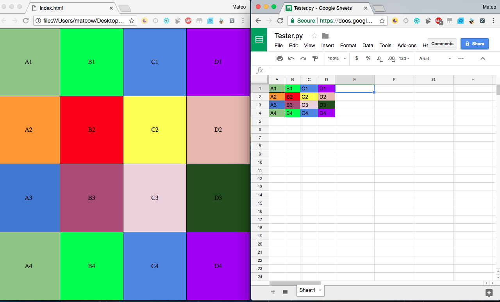

## Google Sheets Database to HTML Table
Python Program to generate HTML Table from Google Sheets Database

## Project Overview: 
Needed a simple yet effective lightweight way of displaying various pieces of data on a television display that is constantly being updated by multiple users. I began looking into considering Google Sheets as a kind of database that offers visual concurrency to those connected. 

## Solution:
A constant update stream from Google Sheets API displayed in a HTML Table.

## Example:

##  How to install & Use 
`git clone https://github.com/MateoWartelle/GoogleSheetsDB-to-HTML.git` 
`cd gsDB-to-HTML` 
`Edit 'YOUR SPREEDSHEET ID' in color_data_extraction function` 
`Set the proper range in main (ie 'A1:E5')` 
`run python gsdbtohtml.py`

## Current Problems
- Does not take into account rows and or columns that are merged. 
Currently this can be done manually by adding rowspan=x and colspan = y to each td entry
- Two Reads + Two Writes : One for reading empty index.html, One for writing Table to index.html, One read for reading table from index.html, One write for adjusting the bgcolor for the table cells. 
- Reads and writes brand new files every single update. I am trying to figure out how to parse the JSON for merged cells and how they would relate to the <td><th> elements in the index.html. The most effective thing to do is to read and write only once and to check only for cell changes in colors and data. This way we would not have to write index.html over and over as it may become a larger cell range than I originally tested. 
- Does not take into account AA, BB rows after Z. I have seen this many rows only a few times and am sure I could get something working for these larger tables.

